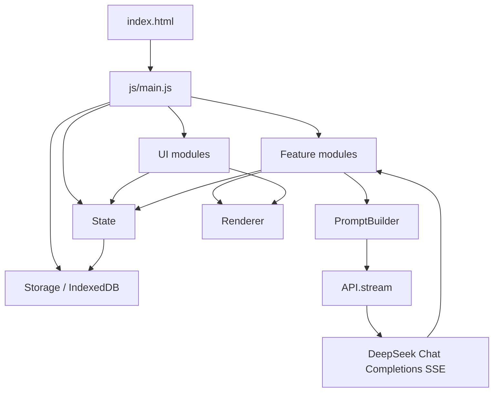

# 架构与文件职责

> 酒馆是纯静态 HTML + 原生 JavaScript 应用。没有 React/Vue、没有构建系统、没有 npm 运行时依赖。所有功能在浏览器中通过 `index.html` 直接加载。

## 一、总体架构



运行时没有模块打包，脚本通过全局对象协作。新增文件时要在 `index.html` 中按依赖顺序引入。

## 二、数据流

### 初始化

```text
index.html
  -> js/main.js init()
  -> Storage.init()
  -> State.loadSettings()
  -> State.loadCharacters()
  -> State.loadScenes()
  -> State.normalizeScene()
  -> 初始化 ChatUI / sidebars / QuestTracker / MapView / editors
  -> 显示世界大厅或最近场景
```

### 玩家发言到 AI 回复

```text
ChatUI 收集输入
  -> scene.messages push user message
  -> GroupChat.handleUserMessage()
  -> 选择回复角色
  -> PromptBuilder.build() 或 buildGroup()
  -> API.stream()
  -> ChatUI 流式渲染
  -> GroupChat._extractStateUpdate()
  -> StrategyManager.applyStateUpdate()
  -> GroupChat._parseMarkers()
  -> GroupChat._processMarkers()
  -> 保存 assistant message
  -> Relationship 更新
  -> WorldEngine.tickAfterPlayerTurn()（成功回复且无待掷检定时）
  -> State.saveCurrentSceneDebounced()
```

### 地图移动

```text
MapView.moveTo(locId)
  -> WorldEngine.moveToLocation()
  -> 规则层校验相邻地点/结局锁
  -> 规则层更新 scene.currentLocation
  -> 规则层插入【移动到 ...】 user/action 消息并写 eventLog.movement
  -> GroupChat.handleLocationMove()
  -> PromptBuilder.buildDMNarration()
  -> API.stream()
  -> 保存 narrate 消息
```

### 计策状态补丁

```text
AI 回复文本
  -> <state_update>{...}</state_update>
  -> GroupChat._extractStateUpdate()
  -> JSON.parse()
  -> StrategyManager.applyStateUpdate()
  -> 白名单更新 strategies/knowledge/factions/relationships/scene/items/locations/clocks/storyArcs/counterStrategies/agenda
  -> WorldEngine 归一化时钟/反制/日程
  -> 右侧面板重渲染
```

## 三、文件职责

### 根目录

| 文件 | 职责 |
|------|------|
| `index.html` | 应用入口，DOM 结构，脚本加载顺序 |
| `README.md` | 项目说明、手动测试清单、开发约束 |

### `css/`

| 文件 | 职责 |
|------|------|
| `base.css` | 全局变量、基础排版、通用元素 |
| `layout.css` | 主布局、侧边栏、响应式结构 |
| `components.css` | 聊天、任务、背包、计策等组件样式 |
| `themes.css` | 主题/视觉风格补充 |

### `js/core/`

| 文件 | 职责 |
|------|------|
| `state.js` | 全局状态、当前场景/角色访问器、旧存档字段补齐、场景创建保存 |
| `storage.js` | IndexedDB 封装，characters/scenes/settings/snapshots store |
| `api.js` | DeepSeek Chat Completions SSE 调用、重试、错误归类、停止流 |
| `prompt-builder.js` | 单聊/群聊/DM/教学 prompt 组装，规则层、剧情弧、计策协议注入 |
| `ai-generator.js` | 辅助 AI 生成能力，例如自定义世界 JSON |

### `js/features/`

| 文件 | 职责 |
|------|------|
| `world-generator.js` | 预设世界、自定义世界生成提示词、模板应用到 scene/characters |
| `world-engine.js` | 局势时钟、剧情弧推进、NPC 日程/离屏行动、反制、消息可见性、物品效果规则、任务目标闸门与奖励结算 |
| `action-planner.js` | 本地行动意图分类、风险预览、建议检定估算 |
| `intent-router.js` | 单输入框自然语言路由，处理帮助、pending action/check、计策、OOC 和高风险行动预览 |
| `group-chat.js` | 多角色回复调度、AI 标记解析、检定、胜负、自动摘要；HP/金币/经验/背包标记委托 `WorldEngine` 结算 |
| `strategy-manager.js` | 计策创建/更新、`<state_update>` 白名单应用；支持字段以 `API_PROTOCOL.md` 和 `PromptBuilder.buildStateUpdateSchemaHint()` 为准 |
| `relationship.js` | 好感/情绪规则更新和 LLM 分析更新 |
| `lorebook.js` | 世界书编辑与管理 |
| `character-card.js` | 角色卡导入、嵌入世界书合并、角色删除 |
| `png-metadata.js` | PNG 角色卡元数据解析/写入 |
| `scene-manager.js` | 场景管理相关功能 |
| `tutorial.js` | 新手教学世界、教学步骤和钩子 |

### `js/ui/`

| 文件 | 职责 |
|------|------|
| `renderer.js` | HTML/属性/URL 安全转义，RP 文本渲染，消息类型解析，剥离 state_update |
| `chat.js` | 输入栏、消息渲染、流式消息 DOM、发送/停止按钮 |
| `sidebar-left.js` | 左侧角色列表和角色选择 |
| `sidebar-right.js` | 右侧计策、线索账本、世界书、地图、任务、背包、详情面板 |
| `quest-tracker.js` | 任务渲染和目标勾选；任务目标闸门、奖励和成长结算委托 `WorldEngine` |
| `map-view.js` | 地图节点渲染和移动校验 |
| `action-bar.js` | 底部/快捷状态与操作栏 |
| `character-editor.js` | 角色编辑 UI |
| `player-creator.js` | 玩家角色创建流程 |
| `new-character-handler.js` | `[new_char:]` / `[char_exit:]` 处理 |
| `icons.js` | SVG 图标 sprite 与图标渲染 |

## 四、核心协议边界

### PromptBuilder 负责“告诉 AI 能做什么”

`PromptBuilder` 注入：

- 角色身份、背景、性格、示例对话、额外设定。
- 世界书、剧情摘要、关系状态。
- NPC 私密设定（动机/恐惧/秘密/筹码，仅用于扮演，禁止直接透露）和信条。
- NPC 个人日程（agenda）和消息可见性过滤后的历史。
- 玩家已知情报（`scene.knowledge.discoveries`，兼容旧 `scene.intel`）。
- 玩家属性、HP、金币、等级、任务、地图、物品。
- 当前局势、局势时钟、NPC/敌方反制。
- 行动意图、检定规则、物品加成、生存系统、动态事件标记。
- 合理性协议。
- 剧情弧。
- 计策主持人协议。

### GroupChat 负责“解析 AI 说了什么”

`GroupChat` 解析：

- `<state_update>` 隐藏补丁。
- `[check:]` 检定。
- `[quest:]` / `[quest_update:]` 任务。
- `[event:]` / `[move:]` 剧情事件和移动。
- `[item_add:]` / `[item_remove:]` / `[item_equip:]` / `[item_unequip:]` 背包。
- `[damage:]` / `[heal:]` / `[gold:]` / `[exp:]` 生存系统。
- `[new_char:]` / `[char_exit:]` 角色登退场。

`Renderer.parseMessageType` 额外解析消息中的 `[emotion:]` 情绪标记，供 UI 渲染头像表情。

### StrategyManager 负责“允许 AI 改哪些状态”

`StrategyManager.applyStateUpdate()` 是状态补丁边界。允许：

- 创建/更新计策。
- 添加玩家知识账本条目（兼容旧 `intelAdd`）。
- 更新 NPC 档案解锁状态。
- 更新势力。
- 更新角色关系、警觉、心情、秘密。
- 更新局势时钟、剧情弧、NPC 日程和反制计划。
- 通过 `WorldEngine.addWorldTension()` 应用 `worldTensionDelta`，并更新 `activeStrategyId`。
- 更新已有任务目标/状态。
- 添加物品。
- 新增/更新地点。

不允许：

- 修改 settings/apiKey。
- 任意覆盖玩家属性、HP、等级、金币。
- 任意覆盖 scene 或 character。
- 直接插入 DOM。

线索账本 UI 位于右侧 `knowledge` tab，由 `SidebarRight.renderKnowledge()` 渲染。它只读取玩家已知的 `scene.knowledge.discoveries` 和已解锁的 `scene.discoveries.characters` 档案槽，不直接展示 NPC 私密设定。

当前局势 UI 位于右侧 `situation` tab，由 `SidebarRight.renderSituation()` 渲染。它读取 `WorldEngine.getCurrentSituation(scene)`，展示当前位置、主线目标、公开时钟、隐藏压力提示、反制、最近风险、可用线索和可选行动。

### WorldEngine 负责“世界如何自己动”

`WorldEngine` 提供：

- `normalizeScene()`：补齐 `clocks`、`counterStrategies`、`currentSituation`、`turnCount`。
- `applyClockUpdate()` / `applyStoryArcUpdate()` / `applyCounterStrategyUpdate()` / `applyNpcAgendaUpdate()`：供 `StrategyManager` 白名单调用。
- `tickAfterPlayerTurn()`：成功完成的玩家回合、休息、部分成功/失败后推进时钟并触发离屏行动；AI 回复失败/中断不推进，待掷检定会延后到掷骰结算后推进。
- `filterMessagesForCharacter()`：按 `message.visibility` 过滤当前 NPC 可见历史。
- `getCheckItemBonus()` / `getAvailableCheckItems()` / `consumeCheckItems()`：把自动物品修正和可用消耗品接入检定卡。
- `getStrategyItemResources()` / `consumeStrategyItemResources()`：把 `strategy_leverage` 物品接入计策 prompt/侧栏，并在计策执行或结算时扣除明确投入的可消耗物品。
- `applyEvidenceAdd()`：把探索取得的证据写入证据账本，同步线索链、知识账本、关键结论，并按证据首次取得发放少量经验和主题补给。
- `addExperience()`：统一任务、剧情标记、探索、挑战和物品的经验结算；负责升级、属性点、最大生命和升级提示。
- `addWorldTension()`：统一世界紧张度变化、事件日志、局势刷新和世界紧张度失败条件检查。
- `useInventoryItem()` / `restPlayer()` / `buyBasicSupply()` / `sellInventoryItem()`：处理背包直接使用、休息恢复、基础购买与出售非关键物品，复杂交易仍交给行动/AI 流程。
- `createInventoryItemFromReward()` / `grantInventoryItem()` / `removeInventoryItem()` / `addOrMergeInventoryItem()` / `allocateStatPoint()`：把任务/AI 奖励物品语义化，统一物品堆叠、移除、装备槽清理，并处理属性点分配与 HP 重算。
- `recordEvent()` / `getEventLog()`：记录并读取冒险过程日志；旧存档没有日志时可从关键消息派生最近事件。
- `recordConsequence()` / `getActiveConsequences()` / `getConsequenceRiskModifier()`：把持续后果写入账本、展示到局势面板，并反馈到行动预览风险/DC。

`QuestTracker` 只负责渲染任务和处理玩家点击；任务奖励、经验、物品和升级副作用必须委托给 `WorldEngine`，不能在任务面板内直接改金币、经验、背包或等级。

### 行动预览流程

```text
玩家切换 /行动
  -> 输入行动目标
  -> ActionPlanner 生成 scene.pendingAction
  -> 输入区显示风险卡
  -> 玩家确认
  -> ChatUI 写入 action_intent 用户消息
  -> PromptBuilder 注入 [玩家行动意图]
  -> AI 叙事 / 要求 [check:] / 产生状态变化
  -> WorldEngine 根据成功完成的回合结果推进时钟/离屏行动
```

`[check:]` 会创建 `scene.pendingCheck` 并在输入区显示检定卡。玩家点击“掷骰”或在主输入框输入“掷骰”后，系统写入 `type: "check"` 的结果消息，再触发 DM 续写后果。
检定卡会区分自动生效修正、可选消耗品和可选已解锁同伴协助；玩家点选资源后，掷骰会把资源加成/DC 调整写入结果并扣除对应 uses/数量。
检定结果分为 `critical_success`、`success`、`partial`、`fail`、`critical_fail`；部分成功和失败会写入最近风险并可推进时钟。

## 五、安全约束

### XSS

所有进入 DOM 的用户、AI、导入角色卡、世界书文本必须走：

- `Renderer.escapeHtml(text)`：HTML 正文。
- `Renderer.escapeAttr(text)`：属性值。
- `Renderer.safeUrl(url)`：URL，仅允许 `http:`、`https:`、`mailto:`、`data:image/png`、`data:image/jpeg`、`data:image/webp`、`blob:`。

不得用未转义字符串写：

```js
el.innerHTML = userOrAiText;
```

可接受模式：

```js
el.innerHTML = `<div>${Renderer.escapeHtml(userOrAiText)}</div>`;
```

### API Key

- API key 只应存在于 `State.settings.apiKey` / IndexedDB settings。
- 不写入聊天消息、DOM、URL、console。
- 导出 `Storage.exportAll()` 时会包含 settings；分享导出数据前应清理 key。

### AI 输出

- `<state_update>` 必须隐藏，不进入最终聊天正文。
- JSON 解析失败只 warn，不中断聊天。
- 补丁必须白名单应用，不允许 `Object.assign(scene, update)`。
- 方括号标记删除后再保存正文，避免玩家看到协议噪声。

### 持久化

- 不重写 IndexedDB 架构，除非同步升级 `DB_VERSION` 和迁移逻辑。
- 新增 scene 字段必须同步 `State.createScene()` 和 `State.normalizeScene()`。
- 高频保存使用 `saveCurrentSceneDebounced()`，避免每 token 写库。

## 六、扩展新功能的步骤

### 新增 scene 字段

1. 在 `State.createScene()` 加默认值。
2. 在 `State.normalizeScene()` 为旧存档补默认值。
3. 如需 UI，更新对应 sidebar/action bar 渲染。
4. 如需 AI 知道，更新 `PromptBuilder.buildRulesContext()` 或专用 prompt 块。
5. 如需 AI 修改，谨慎扩展 `StrategyManager.applyStateUpdate()` 白名单。
6. 更新 `docs/GAME_STATE.md` 和 `docs/API_PROTOCOL.md`。

### 新增 AI 标记

1. 在 `PromptBuilder` 的规则层或格式要求中说明标记。
2. 在 `GroupChat._parseMarkers()` 添加正则。
3. 在 `_processMarkers()` 分派。
4. 实现 `_handleXMarker()`，只做必要状态变更。
5. 渲染前使用 `Renderer`。
6. 更新 `docs/API_PROTOCOL.md`。

### 新增右侧面板

1. 在 `index.html` 增加 tab 和容器。
2. 在 `sidebar-right.js` 增加渲染和 tab 切换。
3. 在 CSS 增加组件样式。
4. 若与 scene 状态相关，监听 `sceneChanged` 或在状态变更处手动重渲染。
5. 移动端检查侧边栏打开/关闭行为。

## 七、测试与验收

当前项目没有自动化测试框架，最小验收：

```powershell
node --check js/core/*.js
node --check js/features/*.js
node --check js/ui/*.js
node --check js/main.js
```

手动回归重点：

- 打开 `index.html` 或本地静态服务。
- 新建世界、创建玩家、发送消息。
- AI 流式回复和停止按钮状态恢复。
- 检定、伤害、回血、金币、经验、升级。
- 任务新增/完成/胜利。
- 地图移动和地点旁白。
- 背包添加/装备/卸下。
- 计策创建/更新、刷新后仍保留。
- XSS 输入不执行脚本。
- 非法 `<state_update>` 不破坏聊天。

## 八、agent 开发约束

任何 agent 修改代码时必须遵守：

- 保持纯静态架构，不引入构建系统。
- 不添加 npm 依赖，除非项目明确改变技术路线。
- 优先复用现有全局对象和 UI 风格。
- 不绕过 `Renderer` 做 DOM 拼接。
- 不把 AI 状态补丁扩展成任意状态写入。
- 不破坏人类玩家流程；agent 自动化是附加能力。
- 变更协议时同步更新 `docs/`。
